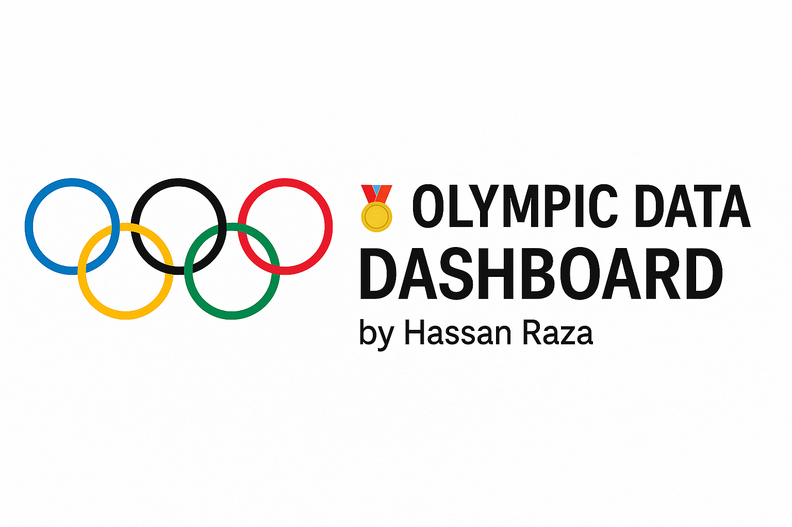

# 🏅 Olympic Data Dashboard

📊 A Streamlit dashboard analyzing Olympic athlete data by country, gender, year, and sport — interactive and insightful.

This is a simple Streamlit dashboard made by **Hassan Raza**.  
It shows Olympic athlete data like medals by country, gender breakdown, and participation over the years.

---

## 💻 How to Run This Project on Your Computer

### Step 1: Install Python
If you don't have Python, download it here: https://www.python.org/downloads  
👉 During install, make sure you check the box **"Add Python to PATH"**

---

### Step 2: Download This Project

Click the green **"Code"** button at the top right of this page, then click **Download ZIP**.  
Unzip it anywhere on your computer.

---

### Step 3: Install Required Libraries

Open Command Prompt and type:

```bash
pip install streamlit pandas matplotlib seaborn plotly 
